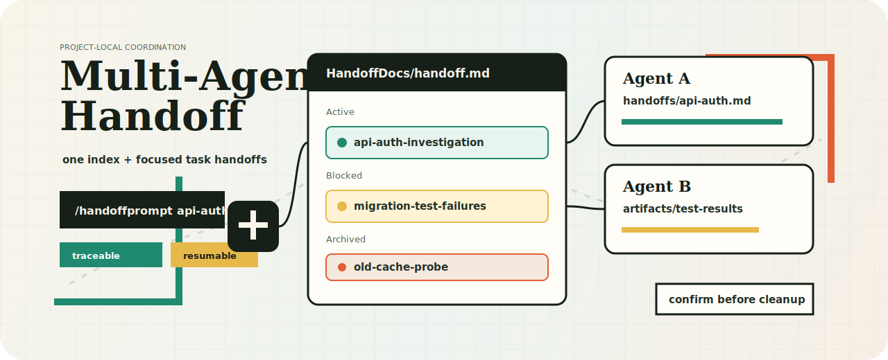

<p align="center">
  
</p>

<h1 align="center">Multi-Agent Handoff</h1>

<p align="center">
  面向 Claude Code、Codex 和手动启动的 Agent 会话的项目级交接协议。
  <br>
  按任务拆分上下文，让并行 Agent 可追踪、可接续，并避免过期笔记污染新工作。
</p>

<p align="center">
  <a href="#为什么需要它">为什么需要它</a>
  ·
  <a href="#安装">安装</a>
  ·
  <a href="#工作流">工作流</a>
  ·
  <a href="#命令">命令</a>
  ·
  <a href="#文件结构">文件结构</a>
  ·
  <a href="#开源协议">开源协议</a>
</p>

---

## 为什么需要它

真实的 Agent 工作很少只有一条干净的会话线。你可能让一个会话排查测试失败，让另一个会话整理迁移方案，再让第三个会话准备交给下一位 Agent 的提示词。所有内容都塞进一个巨大的 `HANDOFF.md`，很快就会变成多个会话共同编辑的上下文泥潭。

`multi-agent-handoff` 用一个紧凑索引，加上每个任务一份独立 handoff 文件，来管理手动多 Agent 协作：

- 每个任务都有自己的聚焦上下文；
- 每个 Agent 只更新自己的任务文件和索引行；
- 报告、测试输出、临时脚本、截图等过程产物放到可预测的位置；
- 归档、学习笔记和旧时间戳产物默认不作为当前上下文读取；
- 移动、删除、归档、修改 git 元数据等高风险操作必须先确认。

它不是复杂平台，而是一套足够无聊、足够稳定的多 Agent 项目协作操作系统。

## 安装

克隆仓库，然后运行安装脚本。默认安装到用户级 Codex skills 目录，采用复制模式，适合普通使用和 Windows 环境：

```powershell
git clone https://github.com/LoganShiAIT/multi-agent-handoff-skill.git
cd multi-agent-handoff-skill

.\scripts\install.ps1
```

macOS 或 Linux：

```bash
git clone https://github.com/LoganShiAIT/multi-agent-handoff-skill.git
cd multi-agent-handoff-skill

bash scripts/install.sh
```

开发时如果希望安装目录跟随仓库实时变化，可以使用 link 模式：

```powershell
.\scripts\install.ps1 -Mode link
```

```bash
bash scripts/install.sh --mode link
```

Claude Code 的 slash command 需要同步到 Claude command 目录。项目级命令通常放在目标项目的 `.claude/commands/`，请把参数指向那个目录：

```powershell
.\scripts\install.ps1 -ClaudeCommandsDir C:\path\to\your-project\.claude\commands
```

```bash
bash scripts/install.sh --claude-commands-dir ../your-project/.claude/commands
```

对于不能自动加载 skill 的工具，可以让 Agent 手动读取 [`multi-agent-handoff/SKILL.md`](multi-agent-handoff/SKILL.md)。

## 验证

仓库提供零依赖校验脚本，用来检查 skill frontmatter、命令引用、`Filesystem Operations Checklist` 和示例结构：

```powershell
.\scripts\validate-skill.ps1
```

```bash
bash scripts/validate-skill.sh
```

## 工作流

进入项目后，先用 `/explorehandoff` 只读探索任务形态。探索阶段不创建 `HandoffDocs/`，也不修改项目文件；它只判断本次工作是否需要 handoff，以及应该使用 light 还是 full。

```text
/explorehandoff
   |
   |-- none  -> 直接回答或继续探索，不建 handoff
   |-- light -> /inithandoff --light <slug>
   `-- full  -> 用户确认后 /inithandoff --full <slug>
```

正式 handoff 分两种：

| 模式 | 适用场景 | 产物 |
| --- | --- | --- |
| Light | 小问题、单任务续接、一次交接即可继续 | `HandoffDocs/light/<task-slug>.md` |
| Full | 多 Agent、跨会话、artifacts、阻塞、归档、压缩或项目级协调 | `HandoffDocs/handoff.md` + `handoffs/` + `artifacts/` |

Light 是单文件便签，不维护总 index，不扫描历史 artifacts，不执行 archive/study/compact。Full 才启用完整项目级治理。默认的项目内 handoff 根目录是 `HandoffDocs/`：

```text
HandoffDocs/
|-- light/
|   |-- api-auth-investigation.md
|   `-- ...
|-- handoff.md
|-- handoffs/
|   |-- api-auth-investigation.md
|   `-- frontend-table-refactor.md
|-- archive/
|-- study/
`-- artifacts/
    `-- api-auth-investigation/
        |-- reports/
        |-- test-scripts/
        |-- test-results/
        `-- misc/
```

`handoff.md` 是 full 模式的项目仪表盘，只存放 active、blocked、done、archived 等任务行。详细上下文放在 `handoffs/<task-slug>.md`。

每个 full 任务 handoff 记录：

- 任务目标、范围和成功标准；
- 上下文面板（Context Panel）：这个槽位讨论什么、必读哪些文件、哪些内容默认不读；
- 已查看的文件和已经运行过的命令；
- 进度日志和关键决策；
- 相关产物路径；
- 压缩过的历史明细留档，以及当前 handoff 指向这些留档的索引；
- 在受控 artifacts 目录之外创建的额外临时文件；
- 交还给下一位 Agent 的当前状态、下一步和风险。

当活跃 handoff 变得过长时，可以用 `/compacthandoff` 先生成一份历史明细 report，再把当前 handoff 精简成仍然可继续工作的上下文。这样历史修改细节不会丢失，但默认启动新 Agent 时也不会被旧日志拖慢。

可以先看 [`examples/explore-output.md`](examples/explore-output.md) 理解探索输出，看 [`examples/light-handoff/`](examples/light-handoff/) 理解 light 便签，看 [`examples/basic-handoff/`](examples/basic-handoff/) 理解 full 索引和活跃任务文件，再看 [`examples/compact-history/`](examples/compact-history/)、[`examples/light-handoffprompt-output.md`](examples/light-handoffprompt-output.md) 与 [`examples/handoffprompt-output.md`](examples/handoffprompt-output.md) 理解压缩历史和交接提示词的形态。

## 命令

内置命令是工作流关口。它们不替代判断，只是把关键时刻显式化。

| 命令 | 用途 |
| --- | --- |
| `/explorehandoff` | 只读探索任务形态，推荐 none、light 或 full，不写 handoff 文件。 |
| `/inithandoff` | 在探索后创建或选择 light/full handoff；无参数默认 light，full 需要明确意图或确认。 |
| `/tracehandoff` | 追加 light 或 full 的进度、验证结果和下一步。 |
| `/compacthandoff` | 仅用于 full，为过长活跃 handoff 生成历史留档 report 并压缩当前上下文。 |
| `/handoffprompt` | 从 light 或 full 生成给另一个 Agent 或新会话的提示词包。 |
| `/archivehandoff` | 仅用于 full，审计任务、分类产物，并准备需要用户确认的归档动作。 |
| `/study` | 生成个人学习笔记；任务绑定只面向 full handoff。 |

## 并行冲突控制

并行 Agent 只有在上下文不互相踩踏时才有价值。

Full handoff 的所有权规则很简单：

- 一个 Agent 级任务对应一个 task slug；
- 一个任务对应一个 handoff 文件；
- 一个任务只占用索引里的一行；
- 对共享索引只做最小局部编辑；
- 过长的活跃上下文先留档再压缩，留档 report 由 handoff 内的历史索引指向；
- 不读取 `archive/`、`study/` 或历史 artifacts，除非当前 handoff 或用户明确指向某个文件。

如果两个 Agent 需要处理同一批文件或同一块领域，要么合并为一个任务 owner，要么把依赖关系写进双方的任务 handoff。

## 安全模型

这个 skill 对文件操作保持保守：

- 正常工作中可以创建和更新 handoff 文件；
- 压缩上下文前必须先创建历史留档 report，失败则不改写原 handoff；
- 把任务移动到 `archive/` 前必须获得确认；
- 移动、删除或重新安置 artifacts 前必须获得确认；
- 修改 `.gitignore`、`.git/info/exclude`、暂存、提交和推送前必须获得确认；
- 旧时间戳产物在验证前都视为可能过期的候选上下文。

这样可以让 handoff 文档持续有用，同时避免它们悄悄改写工作区状态。

## 文件结构

```text
.
|-- README.md
|-- LICENSE
|-- .gitattributes
|-- assets/
|   `-- hero.svg
|-- examples/
|   |-- basic-handoff/
|   |-- compact-history/
|   |-- explore-output.md
|   |-- light-handoff/
|   |-- light-handoffprompt-output.md
|   `-- handoffprompt-output.md
|-- multi-agent-handoff/
|   |-- SKILL.md
|   |-- agents/
|   |   `-- openai.yaml
|   |-- commands/
|   |   |-- archivehandoff.md
|   |   |-- compacthandoff.md
|   |   |-- explorehandoff.md
|   |   |-- handoffprompt.md
|   |   |-- inithandoff.md
|   |   |-- study.md
|   |   `-- tracehandoff.md
|   `-- references/
|       |-- artifact-lifecycle.md
|       |-- handoff-formats.md
|       `-- write-safety.md
`-- scripts/
    |-- install.ps1
    |-- install.sh
    |-- validate-skill.ps1
    `-- validate-skill.sh
```

## 设计原则

- **索引，不堆日志。** 仪表盘保持短小、可操作。
- **任务上下文归任务文件。** 每个 Agent 级任务拥有自己的 handoff。
- **活跃历史可外置。** 任务未结束但 handoff 过长时，先生成历史留档 report，再让当前 handoff 只保留可继续工作的上下文和留档链接。
- **过程产物必须有归处。** 报告、输出、临时脚本和调试笔记不要散落在项目根。
- **旧上下文默认可疑。** 时间戳产物可以提供线索，但不能自动成为当前事实。
- **清理动作先确认。** 标记为候选移动或候选删除，不等于获得执行许可。

## 开源协议

本项目采用 [MIT License](LICENSE)。

选择 MIT 的原因很直接：`multi-agent-handoff` 是一个可复用的 agent skill/template，目标是方便个人、团队和商业项目低摩擦复制、改造、分发和二次集成。MIT 足够简洁，也不会给使用方引入额外的复杂合规负担。
