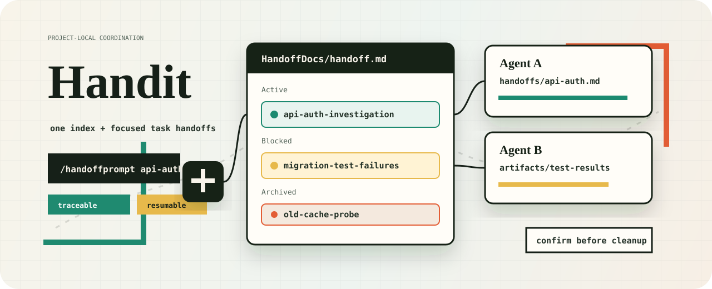

<p align="center">
  
</p>

<h1 align="center">handit skill</h1>

<p align="center">
  面向 Claude Code、Codex 和手动启动的 Agent 会话的项目级交接协议。
  <br>
  按任务拆分上下文，让并行 Agent 可追踪、可接续，并避免过期笔记污染新工作。
</p>

<p align="center">
  <a href="#为什么需要它">为什么需要它</a>
  ·
  <a href="#安装">安装</a>
  ·
  <a href="#工作流">工作流</a>
  ·
  <a href="#命令">命令</a>
  ·
  <a href="#文件结构">文件结构</a>
  ·
  <a href="#开源协议">开源协议</a>
</p>

---

## 为什么需要它

真实的 Agent 工作很少只有一条干净的会话线。你可能让一个会话排查测试失败，让另一个会话整理迁移方案，再让第三个会话准备交给下一位 Agent 的提示词。所有内容都塞进一个巨大的 `HANDOFF.md`，很快就会变成多个会话共同编辑的上下文泥潭。

`handit` 用一个紧凑索引，加上每个任务一份独立 handoff 文件，来管理手动多 Agent 协作：

- task spec 负责初始化讨论、规范和工作项，execution handoff 只负责执行现场；
- 优先绑定 OpenSpec、OPSX 或项目官方 spec，不复制外部规范；
- 每个 work item 都有自己的聚焦执行上下文；
- 每个 Agent 只更新自己的 execution handoff 和索引行；
- 报告、测试输出、临时脚本、截图等过程产物放到可预测的位置；
- 交接 prompt 只在明确请求时即时生成，不在 handoff 中后台维护；
- 归档、学习笔记和旧时间戳产物默认不作为当前上下文读取；
- 移动、删除、归档、修改 git 元数据等高风险操作必须先确认。

它不是复杂平台，而是一套足够无聊、足够稳定的多 Agent 项目协作操作系统。

## 安装

克隆仓库，然后运行安装脚本。默认安装到用户级 Codex skills 目录，采用复制模式，适合普通使用和 Windows 环境：

```powershell
git clone https://github.com/LoganShiAIT/multi-agent-handoff-skill.git
cd multi-agent-handoff-skill

.\scripts\install.ps1
```

macOS 或 Linux：

```bash
git clone https://github.com/LoganShiAIT/multi-agent-handoff-skill.git
cd multi-agent-handoff-skill

bash scripts/install.sh
```

开发时如果希望安装目录跟随仓库实时变化，可以使用 link 模式：

```powershell
.\scripts\install.ps1 -Mode link
```

```bash
bash scripts/install.sh --mode link
```

Claude Code 的 slash command 需要同步到 Claude command 目录。项目级命令通常放在目标项目的 `.claude/commands/`，请把参数指向那个目录：

```powershell
.\scripts\install.ps1 -ClaudeCommandsDir C:\path\to\your-project\.claude\commands
```

```bash
bash scripts/install.sh --claude-commands-dir ../your-project/.claude/commands
```

对于不能自动加载 skill 的工具，可以让 Agent 手动读取 [`handit/SKILL.md`](handit/SKILL.md)。

## 验证

仓库提供零依赖校验脚本，用来检查 skill frontmatter、命令引用、`Filesystem Operations Checklist` 和示例结构：

```powershell
.\scripts\validate-skill.ps1
```

```bash
bash scripts/validate-skill.sh
```

## 工作流

进入项目后，先用 `/explorehandoff` 只读探索任务形态。探索阶段不创建 `HandoffDocs/`，也不修改项目文件；它判断工作应直接回答、先建立 task spec，还是创建 light/full handoff。

```text
/explorehandoff
   |
   |-- none  -> 直接回答或继续探索
   |-- task  -> /inittask <slug> -> /updatetask <slug>
   |                              `-> ready 后从 work item 建 execution handoff
   |-- light -> /inithandoff --light <slug>
   `-- full  -> 用户确认后 /inithandoff --full <slug>
```

协调状态分三种：

| 模式 | 适用场景 | 产物 |
| --- | --- | --- |
| Task Spec | 初始化讨论、需求规范、设计、工作拆分 | 外部 spec 绑定，或 `HandoffDocs/tasks/<task-slug>/` |
| Light | 小问题、单任务续接、一次交接即可继续 | `HandoffDocs/light/<task-slug>.md` |
| Full | 多 Agent、跨会话、artifacts、阻塞、归档、压缩或项目级协调 | `HandoffDocs/handoff.md` + `handoffs/` + `artifacts/` |

Task Spec 与执行状态分离：存在 OpenSpec、OPSX 或项目官方规范时，`HandoffDocs/tasks/<slug>/task.md` 只保存绑定；没有外部规范时才创建 `brief.md`、`spec.md`、可选 `design.md` 和 `tasks.md`。Light 是独立单文件便签，不绑定 task spec。Full 才启用执行级治理。

```text
HandoffDocs/
|-- tasks/
|   `-- add-profile-filters/
|       `-- task.md
|-- light/
|   |-- api-auth-investigation.md
|   `-- ...
|-- handoff.md
|-- handoffs/
|   |-- api-auth-investigation.md
|   `-- frontend-table-refactor.md
|-- archive/
|-- study/
`-- artifacts/
    `-- api-auth-investigation/
        |-- history.md
        |-- reports/
        |-- test-scripts/
        |-- test-results/
        `-- misc/
```

目录按需创建：只有真正写入文件时才建对应子目录，不预先铺空目录。

`handoff.md` 是 full 模式的执行仪表盘，只存放 active、blocked、done、archived 等执行槽。详细执行上下文放在 `handoffs/<execution-slug>.md`。

### handoff 的三层结构

handoff 的读者是下一个 Agent，但写手也是 Agent——人读不懂就没人能发现它记错了。所以结构按**密度**分层，而不是按读者分成两套文档：

```markdown
---
slug / status / owner / updated / branch / task / work_item / checkpoint_commit（可选）
---
# 标题

> **State** 现在到哪了
> **Blocked** 阻塞，或 none

## Scope     目标 / 不做 / 完成判据
## Context   必读 / 可选 / 默认不读
## Log       只记不可推导的事实
```

固定结构只有这些。`Task Binding`、`Artifacts`、`Study Notes`、`History`、`Extra Files` 都是可选段，**有内容才追加**，绝不预置空表。

人读顶部两行就够；Agent 往下读 `Scope` 和 `Context` 拿到边界，读 `Log` 拿到走过的弯路。

### Log 只收不可推导的事实

能从代码、规范或 git 里读出来的，不写进 `Log`：改了哪些文件、跑了什么命令、实现了什么功能，这些复原成本极低，写进来只会制造过期风险。

只写这四类，每条记录开头标出它属于哪一类：

```markdown
- [rejected] 2026-08-03 否决了基于数量的自动压缩，因为数量把体量和过期混为一谈。
```

`failed` 失败的尝试和原因、`rejected` 被否决的方案和理由、`blocker` 仍未解决的阻塞、`decision` 后续工作不该悄悄推翻的决策。类型在写入时确定，之后不再变化。

### 记录会自动下线

每条记录只在还能改变下一个 Agent 动作时才占用上下文。它在三种情况下死亡——**被取代、已落地、已解决**。「已落地」是最常见的一种：一个决策一旦写进代码，就变成可从仓库推导的事实，自动失去 handoff 席位。

哪些死因能作用于一条记录，由它的类型决定，所以淘汰是查表而不是读懂正文：

| 类型 | 何时死亡 |
| --- | --- |
| `decision` | 被取代，或已落地进代码、配置、规范 |
| `blocker` | 被取代，或已解决 |
| `failed` | 永不 |
| `rejected` | 永不 |

由此得到一个反直觉但有用的结果：**成功的决策会自然过期，失败的尝试永不过期**——因为后者在代码里没有任何痕迹，handoff 是它唯一的载体。

淘汰仅在获准的检查点或显式写回中使用已知事实执行，不在执行步骤之间检查，也不为完善记录额外调查、测试或扫描历史：死记录被**移动**到 `artifacts/<execution-slug>/history.md`，不是删除，active handoff 里留一行 `History` 链接。等攒到某个体积再批量压缩，意味着在那之前的每次会话都在加载死上下文。

如果淘汰之后仍有超过 10 条活记录，那不是长度问题而是**范围问题**：此时只报告槽位范围过大这一边界，不生成拆分计划，而不是把真实决策压掉。

自动维护只在当前 Agent 实际观察到当前任务成功 commit，且已有明确选中的 handoff 时执行一次。没有选中对象就跳过，不初始化或扫描。实现、调查、失败、测试、阻塞、暂停和回复结束都不触发维护读写；正常恢复上下文与任务读取不属于维护。

可选 `checkpoint_commit` 记录最后成功自动写回的完整 SHA：重复 SHA 不写，不刷新时间；有效且已授权的 amend 使用新 SHA。失败提交、仅含交接维护文件的提交不触发；包含任务实质交付的混合提交可触发。仅在资格不明确时读取该 commit 的 SHA 和路径，不读完整 diff 来重建日志。

写回只保存已知事实、验证边界、未解决问题和既有用户约束，不按 commit 强制追加日志，不维护下一步或解决路线。维护不催促、创建、拆分、暂存、amend 或 push 提交，不装 hooks、不轮询、不自动追补外部会话提交。共享 handoff 可以保持未提交修改。写入失败单独报告，保留成功 commit，不推进标记、不循环重试。

`/tracehandoff` 或明确“保存/同步交接”可记录未提交事实，保留原 `checkpoint_commit`，不伪造提交关联；没有新增事实或更正时不写文件。初始化、压缩、归档和学习命令保留各自显式授权范围，完成本身不触发额外检查点。

旧 Next / Next Action / Needed / Follow-up 仅是非权威历史建议，不执行、刷新、复制进 prompt 或换名保留。只在明确迁移/压缩选中记录时移除，保留独立授权的约束，其他历史不重写。正式 task/spec 的计划与显式规划命令保持不变。

`/handoffprompt` 是只读、按需、终止型动作。只有明确输入命令或明确要求生成交接 prompt 时才会运行；输出只出现在当次回复，不写回 handoff，也不会被其他命令推荐。接收 Agent 遵循相同的 commit/显式同步边界；返回结果本身不要求写回，也不从旧 Next 生成新任务。

`/compacthandoff` 现在是兜底而非主力：增量淘汰才是常态的长度控制。它只处理两种情况——增量淘汰没压住的超长 handoff，以及需要迁移到当前结构的旧格式文件。如果一个 handoff 超长只是因为活记录确实多，它不会压缩，而是报告槽位范围过大。

可以先看 [`examples/explore-output.md`](examples/explore-output.md) 理解探索输出，再看 [`examples/task-spec-internal/`](examples/task-spec-internal/) 和 [`examples/task-spec-external/`](examples/task-spec-external/) 对比内部规范与外部绑定。Light/full、压缩历史和手动 prompt 输出分别位于 [`examples/light-handoff/`](examples/light-handoff/)、[`examples/basic-handoff/`](examples/basic-handoff/)、[`examples/compact-history/`](examples/compact-history/) 和 [`examples/handoffprompt-output.md`](examples/handoffprompt-output.md)。

## 命令

内置命令是工作流关口。它们不替代判断，只是把关键时刻显式化。

| 命令 | 用途 |
| --- | --- |
| `/explorehandoff` | 只读探索任务形态，推荐 none、task、light 或 full。 |
| `/inittask` | 初始化内部 task spec，或绑定外部规范并创建 task record。 |
| `/updatetask` | 更新 task spec、绑定、工作项或 readiness；ready 必须由用户明确确认。 |
| `/inithandoff` | 创建 light/full handoff，或用 `--from-task ... --work-item ...` 创建绑定执行槽。 |
| `/tracehandoff` | 仅在用户明确触发时，把指定进展补记到已有 handoff。 |
| `/compacthandoff` | 仅用于 full，为过长活跃 handoff 生成历史留档 report 并压缩当前上下文。 |
| `/handoffprompt` | 明确请求时即时生成提示词包；只读、不落盘、不被其他命令推荐。 |
| `/archivehandoff` | 仅用于 full，审计任务、分类产物，并准备需要用户确认的归档动作。 |
| `/study` | 生成个人学习笔记；任务绑定只面向 full handoff。 |

## 并行冲突控制

并行 Agent 只有在上下文不互相踩踏时才有价值。

Task spec 与 full handoff 的所有权规则很简单：

- 一个 task spec 可以拆成多个 work item；
- 一个 work item 对应一个 execution handoff；
- 每个 execution handoff 只占用索引里的一行；
- task/spec 只由协调者或显式 task 更新动作维护；
- 对共享索引只做最小局部编辑；
- 过长的活跃上下文先留档再压缩，留档 report 由 handoff 内的历史索引指向；
- 不读取 `archive/`、`study/` 或历史 artifacts，除非当前 handoff 或用户明确指向某个文件。

如果两个 Agent 需要处理同一批文件或同一块领域，要么合并为一个任务 owner，要么把依赖关系写进双方的任务 handoff。

## 安全模型

这个 skill 对文件操作保持保守：

- 只在合格 commit 检查点或显式授权动作中写 handoff；
- 创建内部 task spec 或外部绑定不等于获得外部规范写权限；
- 压缩上下文前必须先创建历史留档 report，失败则不改写原 handoff；
- 把任务移动到 `archive/` 前必须获得确认；
- 移动、删除或重新安置 artifacts 前必须获得确认；
- 修改 `.gitignore`、`.git/info/exclude`、暂存、提交和推送前必须获得确认；
- 旧时间戳产物在验证前都视为可能过期的候选上下文。

这样可以让 handoff 文档持续有用，同时避免它们悄悄改写工作区状态。

## 文件结构

```text
.
|-- README.md
|-- LICENSE
|-- .gitattributes
|-- assets/
|   `-- hero.svg
|-- examples/
|   |-- basic-handoff/
|   |-- compact-history/
|   |-- explore-output.md
|   |-- light-handoff/
|   |-- light-handoffprompt-output.md
|   |-- task-spec-external/
|   |-- task-spec-internal/
|   `-- handoffprompt-output.md
|-- handit/
|   |-- SKILL.md
|   |-- agents/
|   |   `-- openai.yaml
|   |-- commands/
|   |   |-- archivehandoff.md
|   |   |-- compacthandoff.md
|   |   |-- explorehandoff.md
|   |   |-- handoffprompt.md
|   |   |-- inithandoff.md
|   |   |-- inittask.md
|   |   |-- study.md
|   |   |-- tracehandoff.md
|   |   `-- updatetask.md
|   `-- references/
|       |-- artifact-lifecycle.md
|       |-- handoff-formats.md
|       |-- task-specs.md
|       `-- write-safety.md
`-- scripts/
    |-- install.ps1
    |-- install.sh
    |-- validate-skill.ps1
    `-- validate-skill.sh
```

## 设计原则

- **索引，不堆日志。** 仪表盘保持短小、可操作。
- **编排与执行分离。** task spec 管目标与工作项，handoff 管执行现场。
- **外部规范优先。** 已有 OpenSpec、OPSX 或官方 spec 时只保存绑定。
- **Prompt 按需生成。** 普通维护不保存、不刷新、不推荐交接 prompt。
- **活跃历史可外置。** 任务未结束但 handoff 过长时，先生成历史留档 report，再让当前 handoff 只保留可继续工作的上下文和留档链接。
- **过程产物必须有归处。** 报告、输出、临时脚本和调试笔记不要散落在项目根。
- **旧上下文默认可疑。** 时间戳产物可以提供线索，但不能自动成为当前事实。
- **清理动作先确认。** 标记为候选移动或候选删除，不等于获得执行许可。

## 开源协议

本项目采用 [MIT License](LICENSE)。

选择 MIT 的原因很直接：`handit` 是一个可复用的 agent skill/template，目标是方便个人、团队和商业项目低摩擦复制、改造、分发和二次集成。MIT 足够简洁，也不会给使用方引入额外的复杂合规负担。

## 检查点验收

运行 `scripts/validate-skill.ps1` 和 `scripts/validate-skill.sh`；回归用例见 `scripts/test-checkpoint-validators.ps1`。隔离场景与证据边界见 [checkpoint acceptance](examples/checkpoint-acceptance.md)。[legacy 输入](examples/legacy-next/input.md) 特意保留旧 Next。当前 full 示例的 SHA 仅为格式演示，不指向本仓库提交；绑定任务的初始化示例省略该字段。静态校验不能证明真实 Agent 遵守情况或量化 token 节省。
